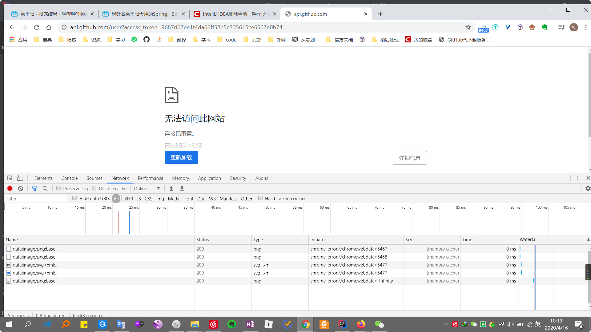
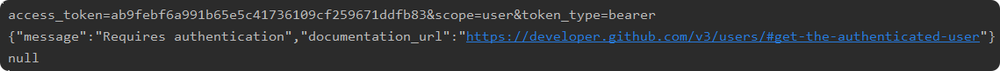

p7  
- bootstrap本地css不成功，使用官方的<link>才能成功[已解决，引用路径错误]
- 没有下拉效果  [已解决，是因为没有引入JQuery的原因]  

p12
- 用 `https://api.github.com/user?access_token=9687d67ee1f4da66ff58e5e335615ce6567e0b74`
  测试请求github user数据，在chrome中无法访问，在firefox中却可以访问
  
- user.getname()返回null,而将user的string信息打印也只得到下面信息
  

